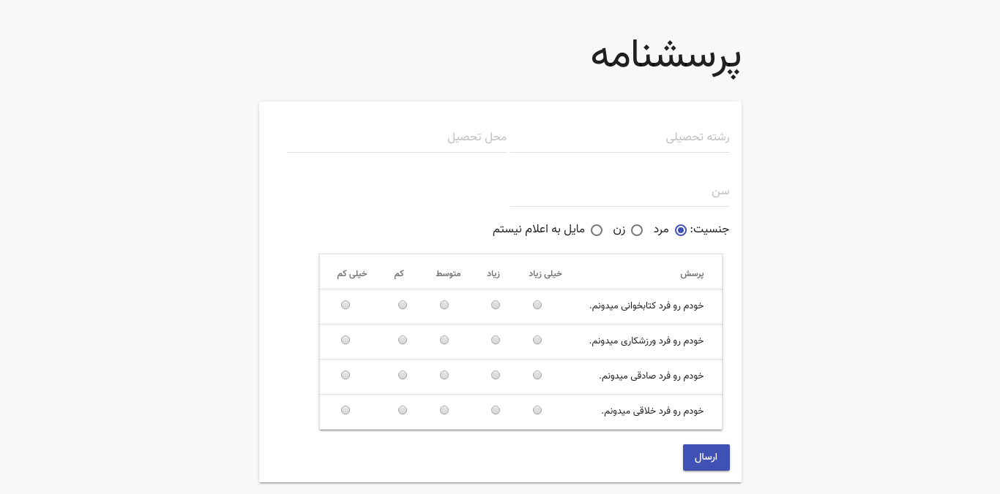

# Contest Matno - Back-End Programming

# Questionnaire System

A **php-based** system script such as vote system to submit form and store it, finally it will show some chart for watching it.

Documentation available at [here](help/doc-fa.pdf), But it's with Persian language. Sorry for it.

Original files of question are in `help` directory.

## Using

- Config and modify _core.php file and put database name and password of mysql
- Import .sql file into your database (using phpmyadmin or with mysql cli or other tools)
- Run index.php file in your browser (Using webserver)
- Enjoy!

## Extra tasks for this project

- Solve problem of age pattern (Age is always a positive number)
- Support persian, arabic number in form
- Display results as some charts in [result.php](src/result.php) file

## Demo System

---------

# Max Base

My nickname is Max, Programming language developer, Full-stack programmer. I love computer scientists, researchers, and compilers. ([Max Base](https://maxbase.org/))

## Asrez Team

A team includes some programmer, developer, designer, researcher(s) especially Max Base.

[Asrez Team](https://www.asrez.com/)
