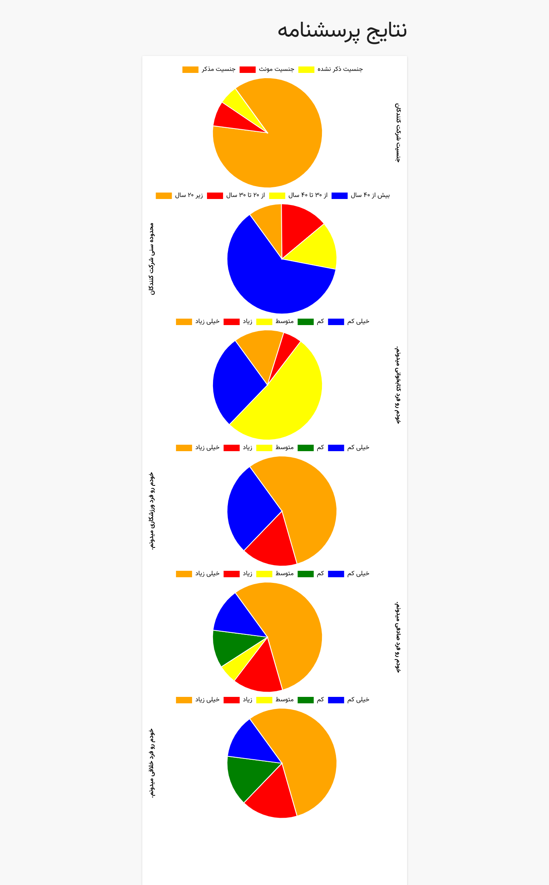

# Contest Matno - Back-End Programming

# Questionnaire System

A **php-based** system script such as vote system to submit form and store it, finally it will show some chart for watching it.

Documentation available at [here](doc.pdf), But it's with Persian language. Sorry for it.

## Using

- Config and modify _core.php file and put database name and password of mysql
- Import .sql file into your database (using phpmyadmin or with mysql cli or other tools)
- Run index.php file in your browser (Using webserver)
- Enjoy!

## Demo System

